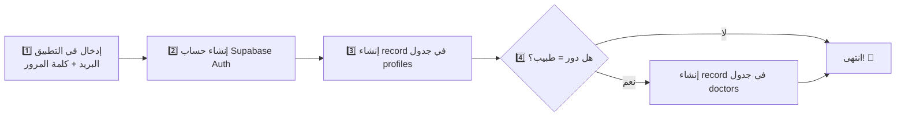

# ⚡ الخطوات الفورية - تفعيل التطبيق مع Supabase

> **الحالة الحالية**: التطبيق يعمل على الهاتف ✅ لكن البيانات غير متصلة بعد!

## 🎯 هدف اليوم: جعل التطبيق "حيًّا"

---

## 1️⃣ احصل على بيانات الاتصال (5 دقائق)

### 👉 على موقع Supabase:

1. اذهب إلى https://supabase.com → Sign In
2. افتح مشروعك
3. في الشريط الجانبي → **Settings** → **API**
4. انسخ:
   - **Project URL**: مثل `https://xyzabc.supabase.co`
   - **Anon Public Key**: مفتاح طويل يبدأ بـ `eyJhbGc...`

**مثال**:

```
URL: https://bqvxlkrtpicejqsodvxy.supabase.co
Key: eyJhbGciOiJIUzI1NiIsInR5cCI6IkpXVCJ9.eyJpc3MiOiJzdXBhYmFzZSIsInJlZiI6ImJxdnhsa3J0...
```

---

## 2️⃣ حدّث الكود (2 دقيقة)

### ✏️ عدّل `lib/main.dart`:

**ابحث عن هذا المقطع**:

```dart
await Supabase.initialize(
  url: 'YOUR_SUPABASE_URL',
  anonKey: 'YOUR_SUPABASE_ANON_KEY',
);
```

**استبدله بـ**:

```dart
await Supabase.initialize(
  url: 'https://bqvxlkrtpicejqsodvxy.supabase.co',  // ❌ استبدل هذا
  anonKey: 'eyJhbGciOiJIUzI1NiIsInR5cCI6IkpXVCJ9...',  // ❌ استبدل هذا
);
```

**💾 احفظ الملف**

---

## 3️⃣ شغّل التطبيق (1 دقيقة)

### في Terminal:

```bash
flutter run
```

### أو اضغط على الجهاز:

- Terminal يظهر `Hot reload` أوتوماتيك
- أو اضغط `r` للتحديث السريع

---

## 4️⃣ جرّب التسجيل (3 دقائق)

### 📱 على الهاتف:

1. اختر **تسجيل جديد** (Sign Up)
2. ملء البيانات:
   - البريد: `test@example.com`
   - كلمة المرور: `Password123`
   - الاسم: `أحمد علي`
   - الدور: **مريض** (جرّب الأول)
3. اضغط "تسجيل"

### 🎉 إذا نجح:

- ستنتقل للشاشة الرئيسية
- ستشاهد شاشة حجز المواعيد

### ❌ إذا فشل:

- ستشاهد رسالة خطأ على الشاشة
- اكتب الخطأ بالضبط وقول لي 👈

---

## 5️⃣ جرّب كطبيب (3 دقائق)

### 📱 على الهاتف:

1. اضغط "تسجيل خروج" (Logout)
2. اختر **تسجيل جديد** (Sign Up)
3. ملء البيانات:
   - البريد: `doctor@example.com`
   - كلمة المرور: `Password123`
   - الاسم: `د. محمود أحمد`
   - الدور: **طبيب** ✅
4. اضغط "تسجيل"

### 🎉 إذا نجح:

- ستشاهد لوحة تحكم الطبيب
- ستشاهد إعدادات العيادة

---

## 6️⃣ تحقق من البيانات (على Supabase)

### 📊 على dashboard.supabase.com:

1. افتح مشروعك
2. في الشريط الجانبي → **Table Editor** أو **SQL**
3. اختر جدول `profiles`
4. ستشاهد المستخدمين اللي سجلوا 👇

```
| id | full_name | role | phone |
|----|-----------|------|-------|
| abc-123 | أحمد علي | patient | NULL |
| def-456 | د. محمود أحمد | doctor | NULL |
```

---

## 🎬 ما يحدث عند التسجيل



---

## ⚠️ المشاكل المتوقعة وحلولها

### مشكلة: "Invalid credentials"

❌ **السبب**: Credentials غير صحيحة
✅ **الحل**: تحقق من نسخ الـ URL والـ Key صحيح من Supabase

### مشكلة: "Network error"

❌ **السبب**: الهاتف غير متصل بالإنترنت
✅ **الحل**: تأكد من:

- WiFi أو بيانات الهاتف مفعلة
- لا يوجد VPN يحجب الوصول

### مشكلة: "Could not find the table 'profiles'"

❌ **السبب**: لم تشغّل schema.sql على Supabase
✅ **الحل**:

1. اذهب إلى **SQL Editor** في Supabase
2. انسخ كل الكود من `supabase/schema.sql`
3. الصق وشغّل ✅

### مشكلة: "Hot reload لا يعمل"

❌ **السبب**: الملف لم يُحفظ أو تغييرات كبيرة
✅ **الحل**:

```bash
# في Terminal:
r        # للـ Hot reload البسيط
R        # للـ Full restart
Ctrl+C   # ثم flutter run (إعادة كاملة)
```

---

## 📊 خطة العمل المتقدمة (بعد التأكد من الاتصال)

| الخطوة | الملف                         | المهمة                                   |
| ------ | ----------------------------- | ---------------------------------------- |
| 1      | `doctor_dashboard.dart`       | جلب بيانات الطبيب من قاعدة البيانات      |
| 2      | `patient_booking_screen.dart` | عرض قائمة الأطباء وتوليد الفجوات الزمنية |
| 3      | `patient_booking_screen.dart` | حفظ الموعد عند تأكيده                    |
| 4      | نشاشة جديدة                   | إنشاء شاشة "مواعيدي" للمريض              |

---

## 🚀 الخطوة التالية

**بعد ما التطبيق يشتغل مع Supabase**:
اكتّب لي:

> "التطبيق متصل! الآن أريد [الميزة التالية]"

---

**وقت التنفيذ**: ~15 دقيقة ⏱️
